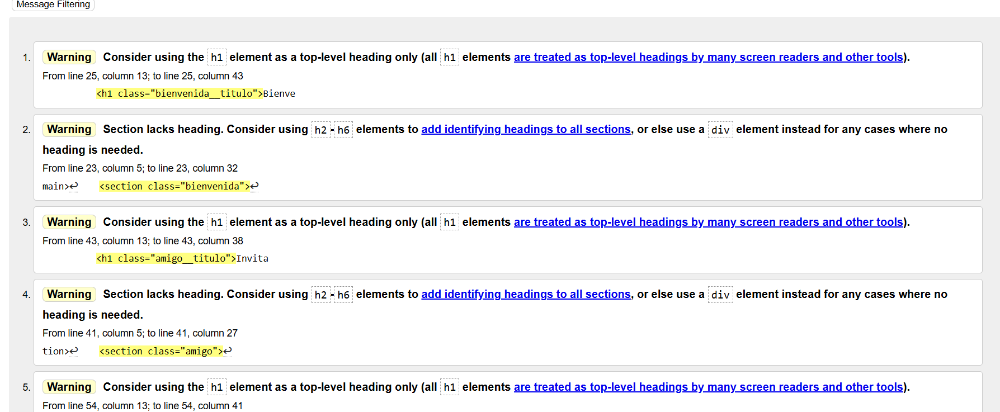
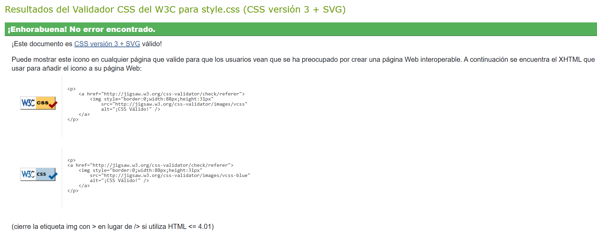
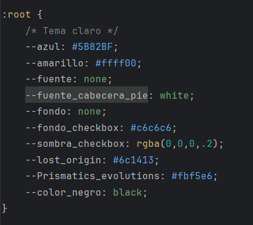

# Proyecto 2º Trimestre

## Pokétienda: Tu tienda online para amantes de Pokémon

**Pokétienda** es una tienda online especializada en productos de Pokémon. Nuestro objetivo es ofrecer una experiencia emocionante para coleccionistas y fanáticos, destacando los productos y servicios que tenemos para ti:

## Nuestros productos
- **Cajas de cartas de Pokémon**: Perfectas para coleccionistas y jugadores.
- **Sobres de cartas de Pokémon**: Descubre nuevas cartas en cada sobre.
- **Cartas valiosas**: Encuentra las joyas más buscadas de tu colección.

## Servicios destacados
- **Carrito de compras**: Encuentra y adquiere tus productos favoritos con facilidad.
- **Descuento exclusivo**: Invita a un amigo y obtén un 5% de descuento en tu compra.
- **Contacto directo**: Resolveremos todas tus dudas y te ayudaremos con cualquier consulta.

Nuestro diseño está enfocado en crear una web clara, fácil de usar y adaptable, para que puedas disfrutarla desde tu ordenador o dispositivo móvil.

¡Bienvenido a **Pokétienda**, donde tu colección Pokémon comienza!

# Características del Proyecto

## Estructura de la web de Pokétienda

La web de **Pokétienda** está diseñada para ser accesible y adaptable a diferentes dispositivos, brindando una experiencia amigable para los fanáticos de Pokémon. Cuenta con las siguientes páginas principales:

## Páginas principales

- **Página Principal**:  
  Ofrece una introducción breve sobre la tienda, destacando qué es **Pokétienda** y cómo busca atender a los fanáticos del universo Pokémon. También incluye un mensaje informativo sobre la promoción del 5% de descuento por invitar a un amigo, incentivando la interacción con la comunidad. Esta página tiene un enfoque simple y no destaca productos específicos.

- **Carrito**:  
  Un carrito de compras básico que permite a los usuarios gestionar los productos seleccionados antes de finalizar la compra. Aunque está en desarrollo, simula un carrito funcional similar al de otras tiendas.

- **Página de Contacto**:  
  Proporciona un espacio para que los usuarios consulten medios básicos de contacto, como correo electrónico o redes sociales. Actualmente, el formulario no es funcional, pero sirve como punto de partida para futuras mejoras.

- **La Tienda**:  
  Actúa como la página central del sitio, donde se muestran las categorías de productos disponibles:
    - Cajas de cartas de Pokémon.
    - Sobres de cartas de Pokémon.
    - Cartas valiosas de colección.  

## Características técnicas

- **Accesibilidad**: La web está optimizada para verse correctamente en dispositivos móviles y de escritorio.
- **HTML5 Semántico**: Utiliza etiquetas semánticas para garantizar una estructura clara y fácil de entender.
- **Estilos CSS con BEM**: Los estilos están organizados con la metodología BEM (Block, Element, Modifier), lo que permite mantener un código modular y limpio.

Con esta estructura, **Pokétienda** proporciona una experiencia sencilla y funcional, enfocándose en la información esencial y las promociones para los coleccionistas de Pokémon.

## Desglose de etiquetas HTML utilizadas

1. **Cabecera del sitio (`<header>`)**  
   Esta etiqueta marca la sección superior de la página, que generalmente incluye elementos como el logo de la tienda y el menú de navegación.


2. **Barra de navegación (`<nav>`)**  
   Contiene los enlaces principales para moverse entre las diferentes páginas del sitio, como la tienda, el carrito y la sección de contacto.


3. **Contenido principal (`<main>`)**  
   Delimita la zona principal de la página, donde se muestra el contenido más importante para el usuario.


4. **Agrupación de contenido (`<section>`)**  
   Sirve para dividir el contenido en bloques relacionados, como una lista de productos o una sección de promociones.


5. **Pie de página (`<footer>`)**  
   Ubicada al final de la página, incluye información adicional como datos de contacto, políticas de privacidad o enlaces a redes sociales.


6. **Formularios de entrada (`<form>`)**  
   Una herramienta para recopilar datos del usuario mediante diferentes métodos (`GET` o `POST`), como el formulario de contacto.


7. **Campos del formulario**
    - **`<input>`**: Utilizado para datos simples como texto, correos electrónicos o contraseñas.
    - **`<select>`**: Crea menús desplegables.
    - **`<textarea>`**: Ofrece un área más grande para que el usuario introduzca texto extenso.


8. **Imágenes (``)**  
   Utilizadas para mostrar gráficos o fotografías. Es importante definir los atributos `src` (ruta de la imagen) y `alt` (texto alternativo para accesibilidad).


9. **Enlaces (`<a>`)**  
   Permiten redirigir al usuario a otras páginas o secciones del sitio. Incluyen atributos como `href` para definir la URL de destino y `target` para controlar cómo se abre el enlace.


10. **Contenido independiente (`<article>`)**  
    Representa un bloque de contenido autónomo que podría ser reutilizado o destacado, como la descripción de un producto o una publicación.


## Validación del código HTML

Se utilizó la herramienta de validación online: [W3C Validator](https://validator.w3.org/). Los archivos HTML fueron analizados y, sorprendentemente, no se encontraron errores graves.



## Herramientas utilizadas

Todo este proyecto se llevó a cabo en el editor _WebStorm_ utilizando las últimas versiones de HTML y CSS.

## Estructura de Carpetas

El proyecto se estructuró siguiendo las pautas recomendadas. Los archivos HTML se colocaron en el directorio principal, acompañados de un archivo README en formato Markdown. Además, se crearon las siguientes carpetas:

- **css**: Para almacenar el código CSS.
- **assets**: Para organizar y guardar las imágenes del proyecto.

# Hojas de Estilo

## Validaciones

Se utilizó un único archivo CSS estructurado bajo la metodología BEM (Bloque, Elemento, Modificador) para garantizar un código claro, organizado y fácil de mantener. Esto también permite que el archivo sea más liviano y facilita la aplicación de futuros cambios.

Además, el archivo CSS fue validado utilizando la herramienta online [W3C CSS Validator](https://jigsaw.w3.org/css-validator/) para asegurar su calidad y conformidad con los estándares actuales.



## Variables



## Animaciones

He introducido un Slide en la tienda

```css
@keyframes slide {
    0% { transform: translateX(0); }
    15% { transform: translateX(0); }
    20% { transform: translateX(-100%); }
    35% { transform: translateX(-100%); }
    40% { transform: translateX(-200%); }
    55% { transform: translateX(-200%); }
    60% { transform: translateX(-300%); }
    75% { transform: translateX(-300%); }
    80% { transform: translateX(-400%); }
}
```

### Responsividad

He conseguido la reponsividad gracias a las media queries:

#### Esto es un ejemplo:

```css
@media (max-width: 480px) {
    .noticias__h1 {
        font-size: 2rem;
        margin-top: 1rem;
        margin-bottom: 0.5rem;
    }

    .noticias__articulo {
        width: 90%; /* Los artículos ocupan casi todo el ancho */
        height: 20rem;
        margin-left: 0.25rem;
        margin-right: 0.25rem;
    }

    .noticias__imagen {
        height: 8rem;
    }

    .noticias__titulo {
        font-size: 0.875rem;
    }

    .noticias__informacion {
        font-size: 0.625rem;
        margin: 0.25rem;
    }
}
```

### Conclusiones

Finalizo aquí la documentación de este Proyecto Web para Lenguaje de Marcas. A lo largo del desarrollo, me enfrenté a diversos retos que pusieron a prueba tanto mis conocimientos como mi paciencia, pero cada obstáculo superado representó una oportunidad para aprender y mejorar.

Este proyecto no solo ha sido una forma de aplicar lo aprendido, sino también de descubrir un interés más profundo por el desarrollo web. Con la incorporación de Javascript en el futuro, estoy seguro de que podré llevar esta idea aún más lejos y completar un sitio aún más funcional y dinámico.

Agradezco el tiempo dedicado a revisar mi trabajo. ¡Espero seguir avanzando en este camino!

